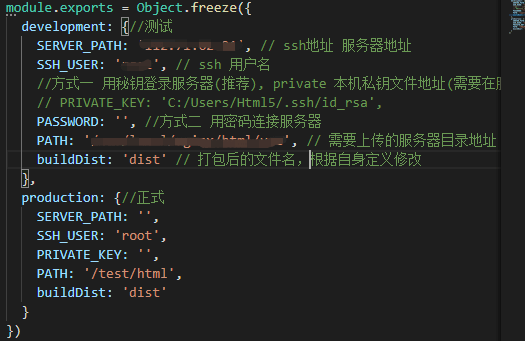
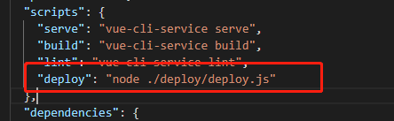

#### 使用指南

1. 下载项目``` git clone https://github.com/kgm1818/web_deploy.git``` 将 ```deploy```文件拷贝到前端项目的根目录下

2. 安装依赖
```bash
    npm install chalk ora shelljs node-ssh inquirer compressing -D
```
3. 配置ssh地址，用户名，上传地址



4. 在 ```package.js``` 中配置命令行



5. 执行命令,选择环境，打包及部署
```bash
    运行 npm run deploy
```